# Chatbot UI End to End CI-CD Pipeline using Jenkins,Docker,Sonarqube,Trivy,AWS EKS

# Jenkins Server Installaition and Configurations
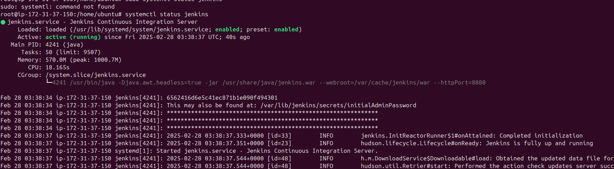
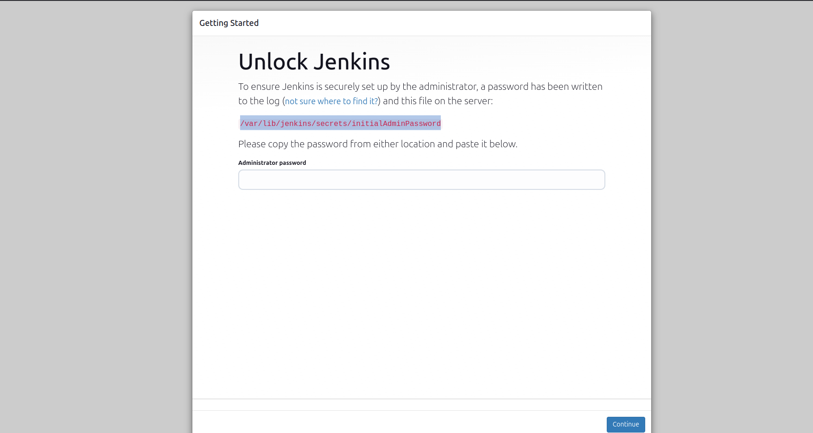
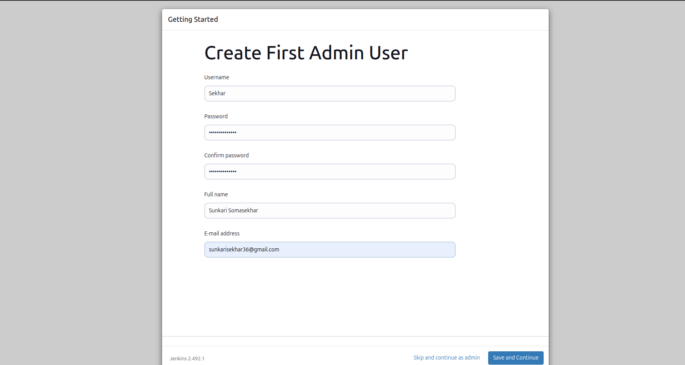

# Sonarube Static Code Analysis On Entire Code of the Application
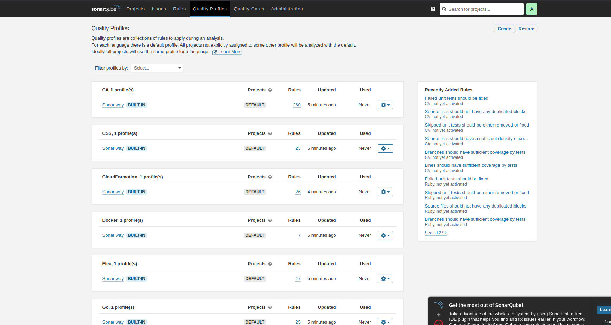

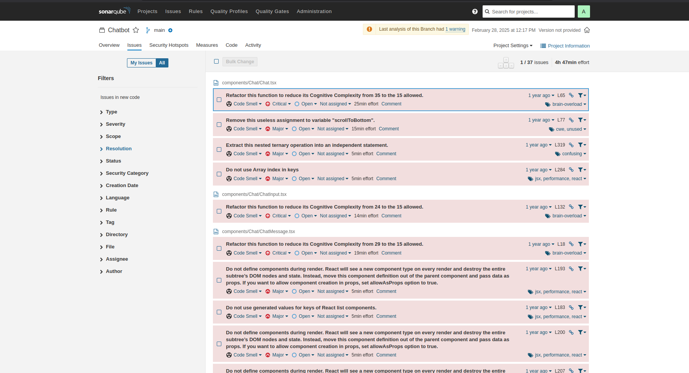
# Sonarqube Quality Gate Passing Sings 

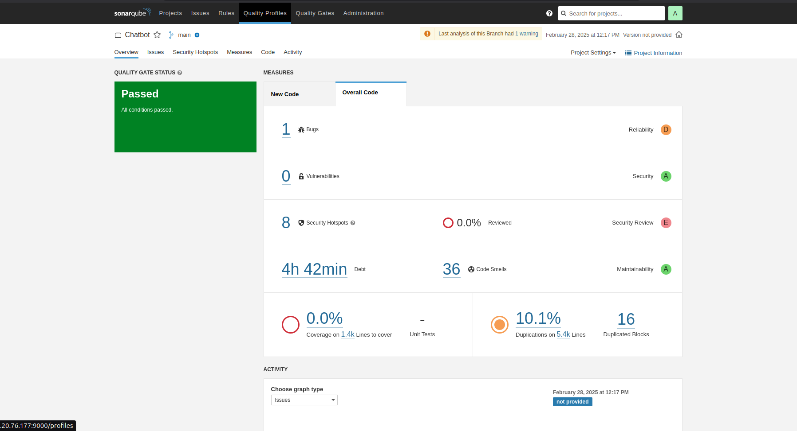

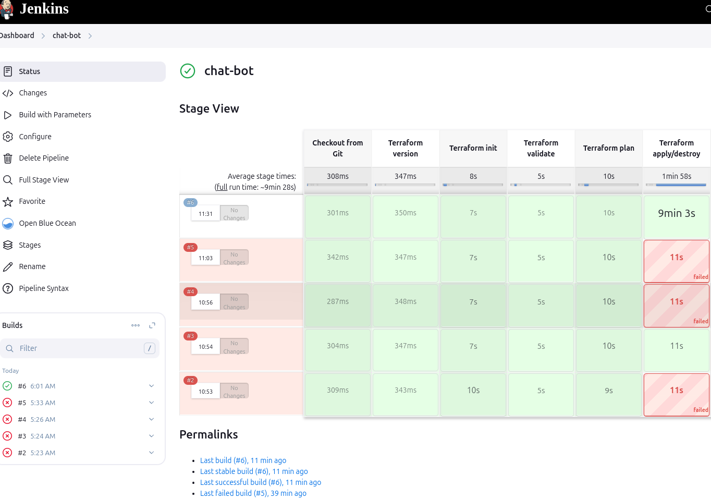
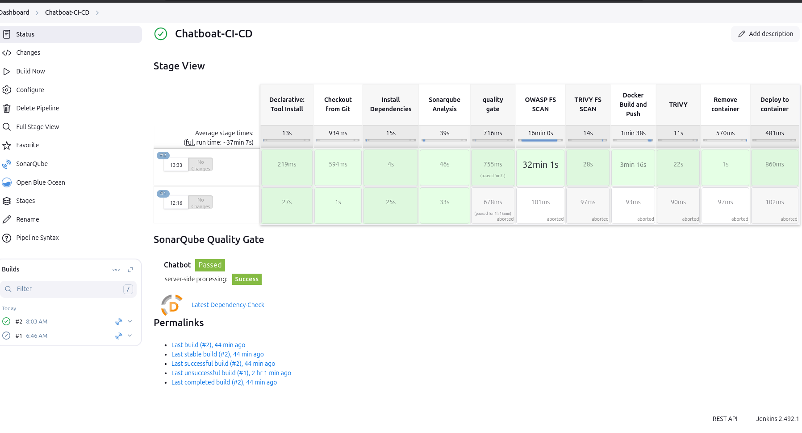
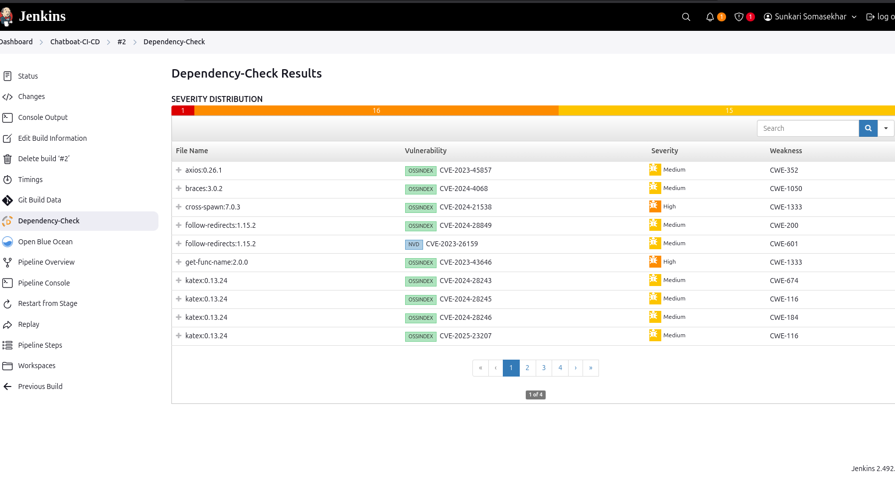
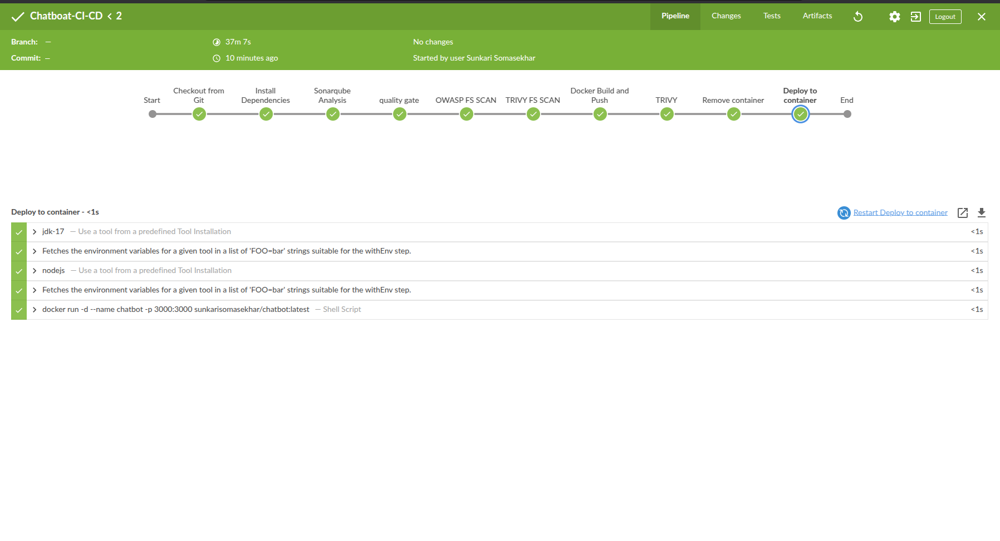
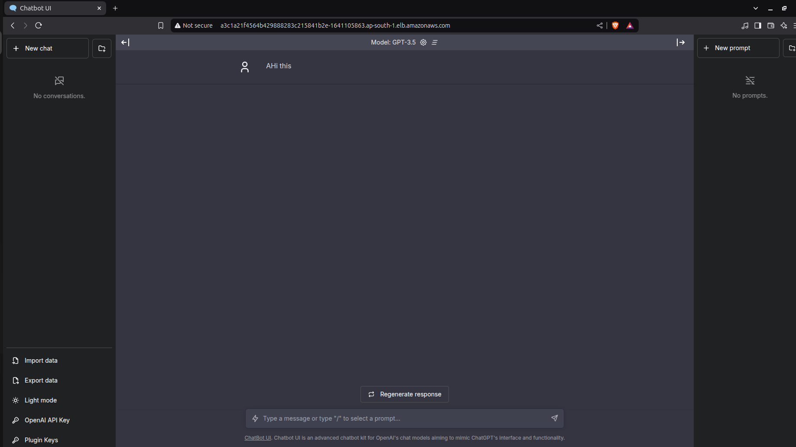
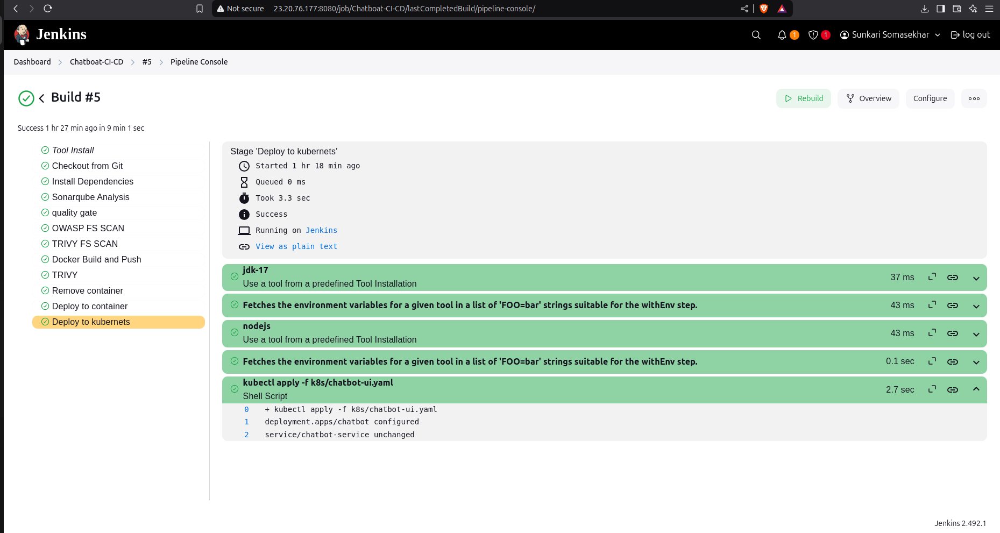
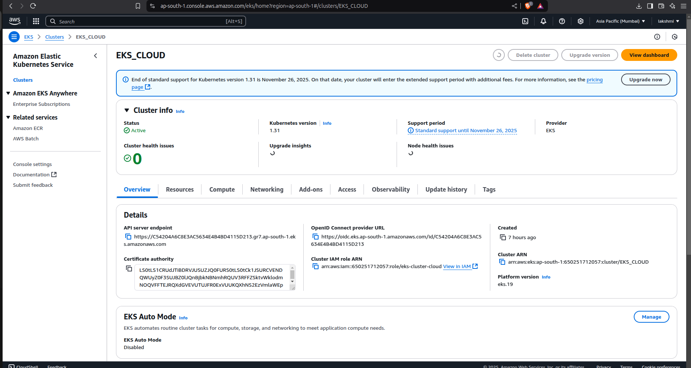
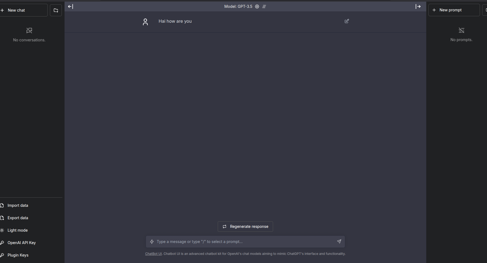

